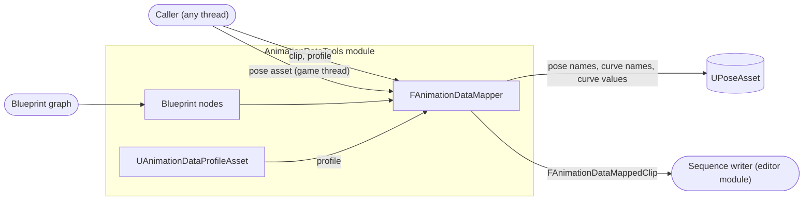

# Main view

The runtime module's parts and what they exchange. Fields and signatures are in the headers.

```mermaid
flowchart LR
    Caller(["Caller (any thread)"]) -->|"clip, profile"| Mapper
    Caller -->|"pose asset (game thread)"| Mapper
    BP(["Blueprint graph"]) --> Nodes
    subgraph module["AnimationDataTools module"]
        Nodes["Blueprint nodes"] --> Mapper["FAnimationDataMapper"]
        Asset["UAnimationDataProfileAsset"] -->|"profile"| Mapper
    end
    Mapper -->|"pose names, curve names, curve values"| Pose[("UPoseAsset")]
    Mapper -->|"FAnimationDataMappedClip"| Writer(["Sequence writer (editor module)"])
```
