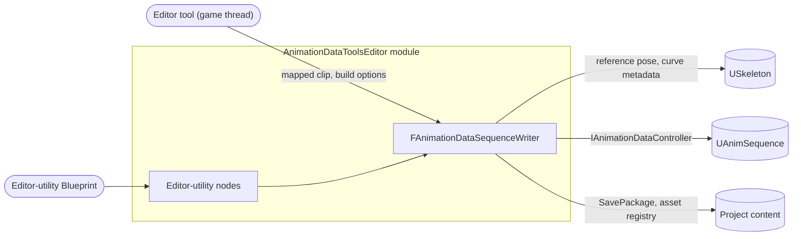

# Main view

The editor module's parts and the engine pieces they write through. Fields and signatures are in the headers.

```mermaid
flowchart LR
    Tool(["Editor tool (game thread)"]) -->|"mapped clip, build options"| Writer
    Utility(["Editor-utility Blueprint"]) --> Nodes
    subgraph module["AnimationDataToolsEditor module"]
        Nodes["Editor-utility nodes"] --> Writer["FAnimationDataSequenceWriter"]
    end
    Writer -->|"reference pose, curve metadata"| Skeleton[("USkeleton")]
    Writer -->|"IAnimationDataController"| Sequence[("UAnimSequence")]
    Writer -->|"SavePackage, asset registry"| Assets[("Project content")]
```
