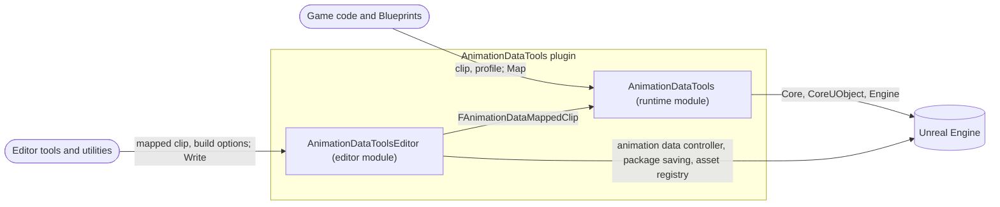

# Main view

The plugin's two modules, who uses each and what they use. Each module's parts are in its own main view.

```mermaid
flowchart LR
    Game(["Game code and Blueprints"]) -->|"clip, profile; Map"| Runtime
    Tools(["Editor tools and utilities"]) -->|"mapped clip, build options; Write"| Editor
    subgraph plugin["AnimationDataTools plugin"]
        Runtime["AnimationDataTools (runtime module)"]
        Editor["AnimationDataToolsEditor (editor module)"] -->|"FAnimationDataMappedClip"| Runtime
    end
    Runtime -->|"Core, CoreUObject, Engine"| UE[("Unreal Engine")]
    Editor -->|"animation data controller, package saving, asset registry"| UE
```
