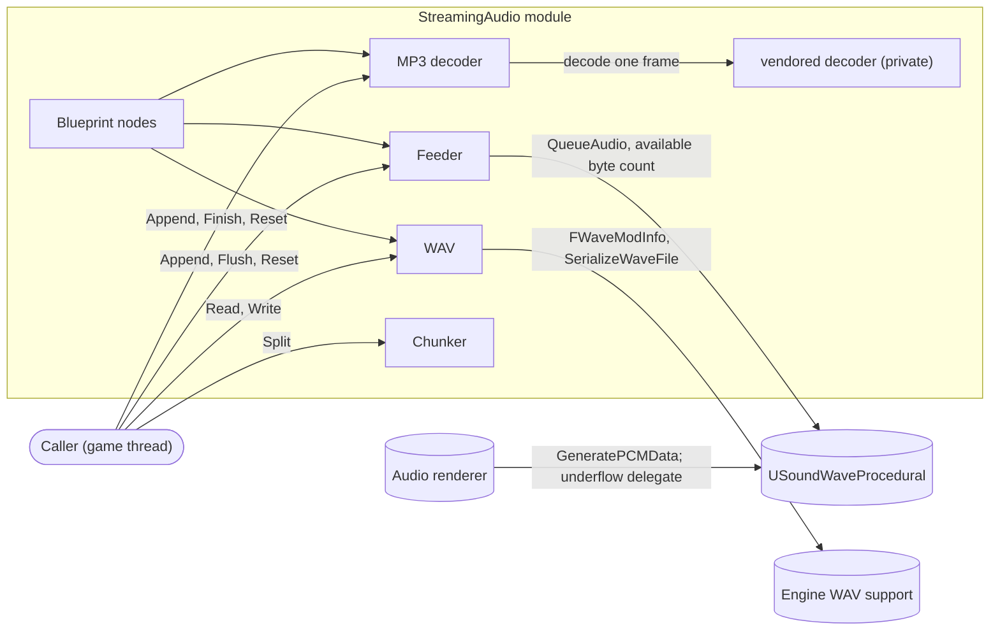

# Main view

The module's parts and the engine pieces they work through. Types and signatures are in the headers.

```mermaid
flowchart LR
    Caller(["Caller (game thread)"]) -->|"Append, Flush, Reset"| Feeder
    Caller -->|"Append, Finish, Reset"| Decoder
    Caller -->|"Read, Write"| Wav
    Caller -->|"Split"| Chunker
    BP["Blueprint nodes"] --> Feeder
    BP --> Decoder
    BP --> Wav
    subgraph module["StreamingAudio module"]
        Feeder["Feeder"]
        Decoder["MP3 decoder"] -->|"decode one frame"| Minimp3["vendored decoder (private)"]
        Wav["WAV"]
        Chunker["Chunker"]
        BP
    end
    Feeder -->|"QueueAudio, available byte count"| Wave[("USoundWaveProcedural")]
    Renderer[("Audio renderer")] -->|"GeneratePCMData; underflow delegate"| Wave
    Wav -->|"FWaveModInfo, SerializeWaveFile"| EngineWav[("Engine WAV support")]
```
