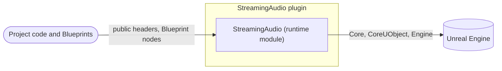

# Main view

The plugin's single module, who uses it and what it uses. The module's own parts are in its main view.

```mermaid
flowchart LR
    Project(["Project code and Blueprints"]) -->|"public headers, Blueprint nodes"| SA
    subgraph plugin["StreamingAudio plugin"]
        SA["StreamingAudio (runtime module)"]
    end
    SA -->|"Core, CoreUObject, Engine"| UE[("Unreal Engine")]
```
