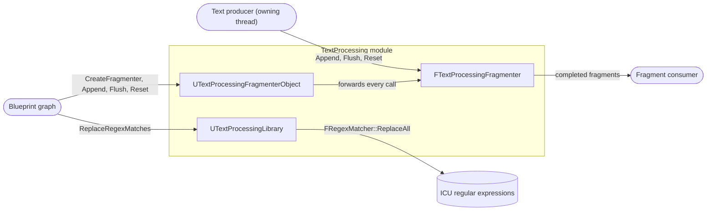

# Main view

The module's parts and their callers. Types and signatures are in the headers.

```mermaid
flowchart LR
    Producer(["Text producer (owning thread)"]) -->|"Append, Flush, Reset"| Fragmenter
    Blueprint(["Blueprint graph"]) -->|"CreateFragmenter, Append, Flush, Reset"| Wrapper
    Blueprint -->|"ReplaceRegexMatches"| Regex
    subgraph module["TextProcessing module"]
        Wrapper["UTextProcessingFragmenterObject"] -->|"forwards every call"| Fragmenter["FTextProcessingFragmenter"]
        Regex["UTextProcessingLibrary"]
    end
    Fragmenter -->|"completed fragments"| Consumer(["Fragment consumer"])
    Regex -->|"FRegexMatcher::ReplaceAll"| ICU[("ICU regular expressions")]
```
