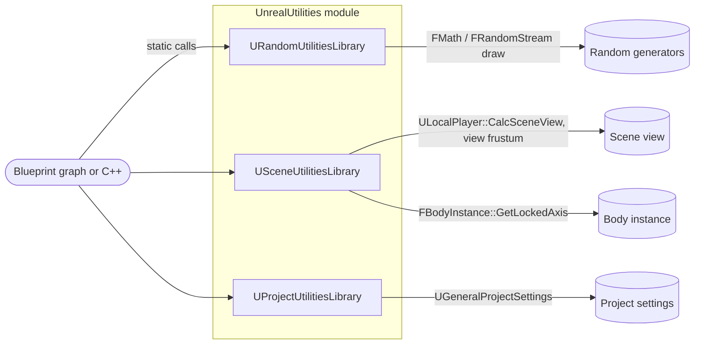

# Main view

The utilities and the engine features each library relies on.

```mermaid
flowchart LR
    BP(["Blueprint graph or C++"]) -->|"static calls"| RandomLib
    BP --> SceneLib
    BP --> ProjectLib
    subgraph module["UnrealUtilities module"]
        RandomLib["URandomUtilitiesLibrary"]
        SceneLib["USceneUtilitiesLibrary"]
        ProjectLib["UProjectUtilitiesLibrary"]
    end
    RandomLib -->|"FMath / FRandomStream draw"| Random[("Random generators")]
    SceneLib -->|"ULocalPlayer::CalcSceneView, view frustum"| View[("Scene view")]
    SceneLib -->|"FBodyInstance::GetLockedAxis"| Physics[("Body instance")]
    ProjectLib -->|"UGeneralProjectSettings"| Settings[("Project settings")]
```
