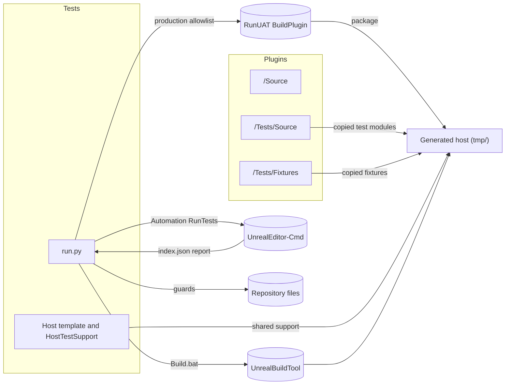

# Main view

How the runner turns a plugin into a test result. Test modules and fixtures live with their plugin;
what each module checks is in its README.

```mermaid
flowchart LR
    subgraph tests["Tests"]
        Runner["run.py"]
        Template["Host template and HostTestSupport"]
    end
    subgraph plugins["Plugins"]
        Production["<Plugin>/Source"]
        TestModules["<Plugin>/Tests/Source"]
        Fixtures["<Plugin>/Tests/Fixtures"]
    end
    Runner -->|"production allowlist"| UAT[("RunUAT BuildPlugin")]
    UAT -->|"package"| Host["Generated host (tmp/)"]
    TestModules -->|"copied test modules"| Host
    Fixtures -->|"copied fixtures"| Host
    Template -->|"shared support"| Host
    Runner -->|"Build.bat"| UBT[("UnrealBuildTool")]
    UBT --> Host
    Runner -->|"Automation RunTests"| Editor[("UnrealEditor-Cmd")]
    Editor -->|"index.json report"| Runner
    Runner -->|"guards"| Repo[("Repository files")]
```
