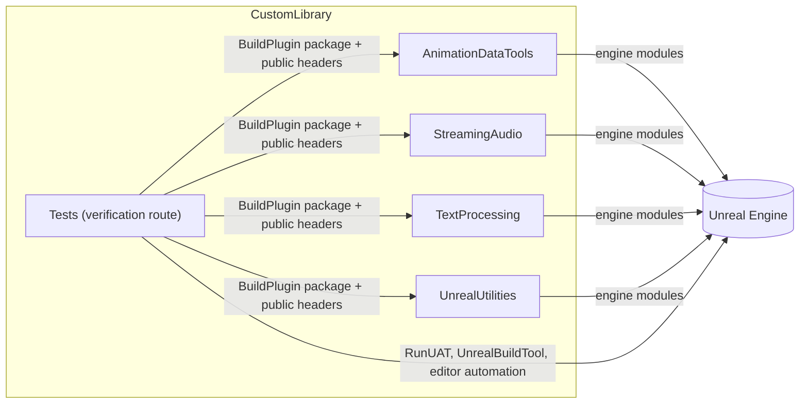

# Main view

The repository's parts and the engine they build on. What happens inside each plugin is in that
plugin's own main view.

```mermaid
flowchart LR
    subgraph repo["CustomLibrary"]
        Tests["Tests (verification route)"]
        CA["AnimationDataTools"]
        SA["StreamingAudio"]
        IT["TextProcessing"]
        BGH["UnrealUtilities"]
        Tests -->|"BuildPlugin package + public headers"| CA
        Tests -->|"BuildPlugin package + public headers"| SA
        Tests -->|"BuildPlugin package + public headers"| IT
        Tests -->|"BuildPlugin package + public headers"| BGH
    end
    CA -->|"engine modules"| UE[("Unreal Engine")]
    SA -->|"engine modules"| UE
    IT -->|"engine modules"| UE
    BGH -->|"engine modules"| UE
    Tests -->|"RunUAT, UnrealBuildTool, editor automation"| UE
```
